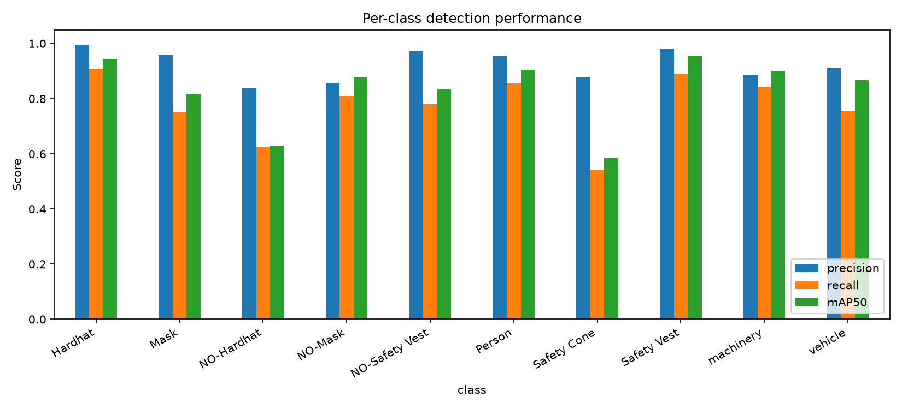
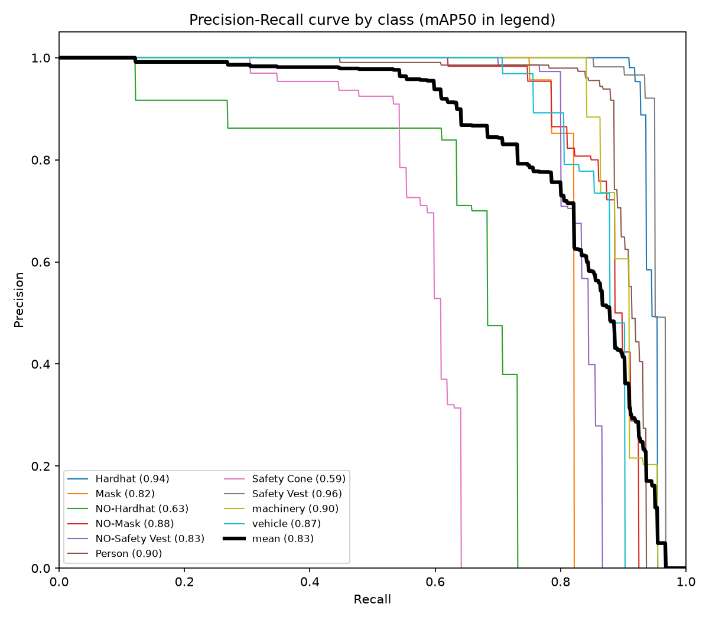
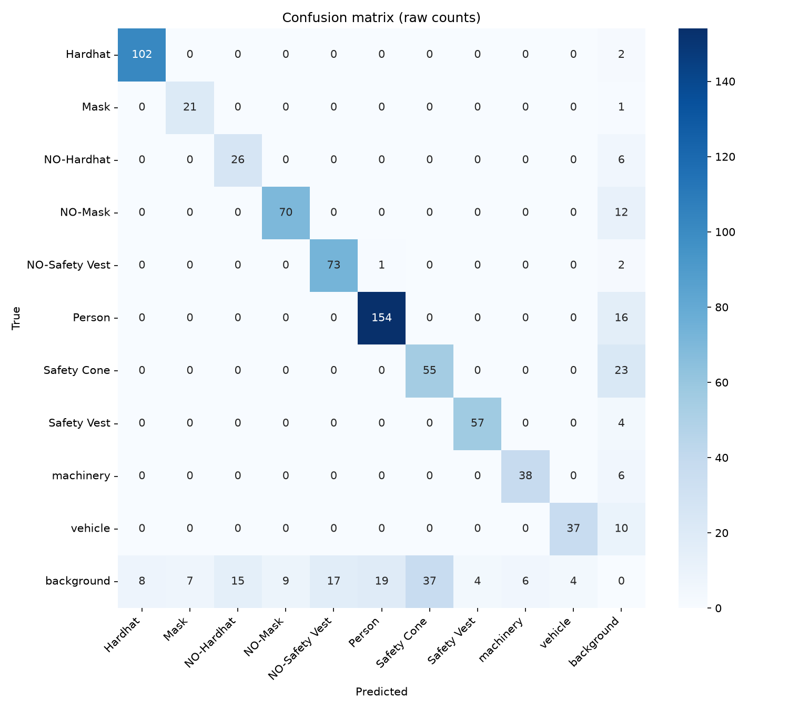
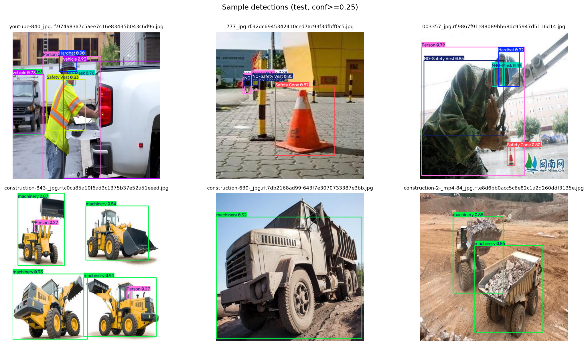

# PPE Compliance Detector

Detects personal protective equipment compliance on construction-site imagery in
real time: hardhats, masks, and safety vests, plus explicit **violation** classes
(`NO-Hardhat`, `NO-Mask`, `NO-Safety Vest`) for workers missing required PPE. Fine-tuned
YOLOv8 on the Roboflow Universe construction-site-safety dataset, served through a Gradio
demo (image/video upload + webcam) and a standalone live-webcam script.

**Flagship model (YOLOv8s): mAP50 = 0.832, mAP50-95 = 0.545 on the held-out test set.**

PPE compliance monitoring is one of the most-cited computer-vision use cases in Western
Australia's mining and resources sector, where construction and extraction occupations
account for a large share of workplace fatalities nationally. In the US, OSHA reported
1,034 construction fatalities in 2024, of which 389 (roughly 38%) were fatal falls -- the
leading single cause of death in the industry -- and fall protection has been OSHA's most
frequently cited violation for 14 consecutive years (6,307 citations in 2024). PPE
compliance is one of the few failure modes in that chain that a camera can actually catch
before an incident, which is why it's such a common real-world computer-vision deployment
in this sector.

## Problem statement

Given a photo, video, or live camera feed of a construction site, flag PPE compliance
state per person: is required equipment present, and is anything explicitly missing? This
is framed as **object detection**, not classification -- multiple people and violations
can appear in one frame, at arbitrary positions and scales, which is exactly what YOLO-style
detectors are built for.

## Dataset

[Roboflow Universe: Construction Site Safety Image Dataset](https://universe.roboflow.com/roboflow-universe-projects/construction-site-safety)
(`roboflow-universe-projects/construction-site-safety`, v28), CC BY 4.0. 2,801 images,
10 classes, pre-split into train (2,605) / valid (114) / test (82), YOLOv8 label format.

Classes: `Hardhat, Mask, NO-Hardhat, NO-Mask, NO-Safety Vest, Person, Safety Cone,
Safety Vest, machinery, vehicle`.

**A note on sourcing:** the mirror named in this project's original brief
(`github.com/snehilsanyal/Construction-Site-Safety-PPE-Detection`) turned out to document
this dataset accurately but not actually contain the image/label files in its git history.
The same underlying Roboflow dataset was obtained instead via a different public mirror
(`github.com/hoanganhtuoi125-gif/Construction-Site-Safety-PPE-Detection`), verified image
by image before use -- full details in `BUILD_LOG.md`.

Download it yourself (not committed to this repo -- see `data/` note below):

```bash
git clone --depth 1 --filter=blob:none --sparse https://github.com/hoanganhtuoi125-gif/Construction-Site-Safety-PPE-Detection.git temp_dataset
cd temp_dataset && git sparse-checkout set Model-Training/Dataset && cd ..
mkdir -p data
cp -r temp_dataset/Model-Training/Dataset/train data/train
cp -r temp_dataset/Model-Training/Dataset/valid data/valid
cp -r temp_dataset/Model-Training/Dataset/test data/test
rm -rf temp_dataset
```

Then write `data/data.yaml`:

```yaml
train: train/images
val: valid/images
test: test/images
nc: 10
names: ['Hardhat', 'Mask', 'NO-Hardhat', 'NO-Mask', 'NO-Safety Vest', 'Person', 'Safety Cone', 'Safety Vest', 'machinery', 'vehicle']
```

**Dataset characteristic worth knowing:** a subset of the source images are themselves
pre-tiled 2x2 photo mosaics baked in at Roboflow export time (four unrelated
construction-site photos combined into one image, each quadrant separately annotated) --
see `notebooks/01_eda.ipynb` for a visual example. This inflates raw
boxes-per-image and means the model sees an unusual four-panel layout during training that
it won't encounter at real inference time.

## Approach

1. **EDA** (`notebooks/01_eda.ipynb`, `src/eda.py`) -- class distribution by split,
   annotation density, image size distribution, sample annotated images.
2. **Training** (`src/train.py`) -- fine-tuned YOLOv8s (flagship) on an NVIDIA RTX 4060 Ti
   (8GB), `device=0`, Ultralytics AutoBatch, up to 200 epochs with patience=30 early
   stopping. A second, separately fine-tuned YOLOv8n checkpoint is kept specifically for
   the live-webcam path (see "Flagship vs. lightweight model" below).
3. **Evaluation** (`src/evaluate.py`) -- mAP50, mAP50-95, per-class precision/recall,
   confusion matrix, all saved as real figures in `figures/` (not left in the gitignored
   `runs/` folder).
4. **Demo** (`src/app.py`, `src/webcam_demo.py`) -- a Gradio app with image upload, video
   upload, and webcam tabs, plus a standalone OpenCV live-webcam script. Both auto-detect
   the best available device (CUDA / Apple Silicon MPS / CPU) at import time, so the exact
   same code runs on this GPU training machine or, e.g., a MacBook Air (M1) doing live
   inference the next day.

### Flagship vs. lightweight model

Training happens on this machine's GPU, but the webcam/live-inference code is meant to run
smoothly on a MacBook Air (M1, Apple Silicon) too. YOLOv8s (the flagship, most-accurate
model, reported in Results below) is more than an M1's MPS backend can comfortably push in
real time alongside a live camera feed and a display loop. So `src/webcam_demo.py` defaults
to a separately fine-tuned, smaller **YOLOv8n** checkpoint (`models/best_lite.pt`) instead
-- smooth live video matters more than squeezing out the last bit of mAP for that specific
mode. The Gradio app's image/video tabs still use the flagship YOLOv8s model
(`models/best.pt`), since those aren't real-time-constrained.

## Results

Flagship YOLOv8s, evaluated on the held-out **test** split (82 images, 760 ground-truth
boxes, never used for training or validation-time model selection). Trained the full 200
epochs (patience-based early stopping never triggered) in 1.637 hours on an RTX 4060 Ti.
Numbers below are the exact output of `python -m src.evaluate --weights models/best.pt
--split test`, not rounded favorably.

**Overall: precision 0.924, recall 0.776, mAP50 0.832, mAP50-95 0.545.**

| Class | Precision | Recall | mAP50 | mAP50-95 |
|---|---|---|---|---|
| Hardhat | 0.996 | 0.909 | 0.944 | 0.672 |
| Mask | 0.958 | 0.750 | 0.817 | 0.564 |
| **NO-Hardhat** | 0.836 | **0.624** | 0.628 | 0.377 |
| NO-Mask | 0.858 | 0.810 | 0.879 | 0.478 |
| NO-Safety Vest | 0.972 | 0.779 | 0.834 | 0.584 |
| Person | 0.955 | 0.855 | 0.905 | 0.624 |
| **Safety Cone** | 0.879 | **0.543** | **0.587** | 0.272 |
| Safety Vest | 0.982 | 0.891 | 0.956 | 0.664 |
| machinery | 0.887 | 0.841 | 0.900 | 0.689 |
| vehicle | 0.911 | 0.756 | 0.866 | 0.529 |








**Two classes are clearly weaker than the rest: `Safety Cone` (recall 0.543, mAP50 0.587)
and `NO-Hardhat` (recall 0.624, mAP50 0.628).** The confusion matrix shows both classes'
errors are almost entirely missed detections against background (37 false-positive Safety
Cone predictions and 23 missed Safety Cone instances), not confusion with other PPE
classes -- there is essentially zero cross-class confusion between any of the ten classes
in this model. `NO-Hardhat` is the more safety-relevant of the two misses: a missed
`NO-Hardhat` detection means a real compliance violation goes unflagged. Full discussion in
`MODEL_CARD.md`.

### Lightweight model (webcam path)

YOLOv8n, fine-tuned the same way, used only by the live-webcam demo. Trained the full 200
epochs in 1.0 hour. On the same test set: precision 0.894, recall 0.721, mAP50 0.776,
mAP50-95 0.480 -- a real but modest drop from the flagship, in exchange for **3.5x fewer
parameters (3.0M vs 11.1M) and 3.5x fewer GFLOPs (8.1 vs 28.5)**, the actual basis for
using it on constrained hardware. (A small-batch GPU speed comparison between the two
models on this training machine was noisy and inconclusive -- Python-side overhead
dominates at that scale -- so it isn't reported here as a real result; the params/GFLOPs
figures are the honest architecture-level comparison, since this session has no way to
benchmark directly on the target MacBook Air.)

| Model | Params | GFLOPs | Precision | Recall | mAP50 | mAP50-95 |
|---|---|---|---|---|---|---|
| YOLOv8s (flagship) | 11.1M | 28.5 | 0.924 | 0.776 | 0.832 | 0.545 |
| YOLOv8n (lite) | 3.0M | 8.1 | 0.894 | 0.721 | 0.776 | 0.480 |



## How to run

```bash
python -m venv .venv
.venv/Scripts/activate        # .venv\Scripts\activate.ps1 on PowerShell; source .venv/bin/activate on macOS/Linux
pip install -r requirements.txt

# GPU training machine only -- installs a CUDA-enabled torch build:
pip install torch torchvision --index-url https://download.pytorch.org/whl/cu126

# set up data/ per the "Dataset" section above, then:
python -m src.eda                                             # regenerate EDA figures
python -m src.train --model yolov8s.pt --name flagship_yolov8s --out models/best.pt
python -m src.train --model yolov8n.pt --name lite_yolov8n --out models/best_lite.pt
python -m src.evaluate --weights models/best.pt --split test --out-prefix flagship
pytest tests/ -v

python -m src.app              # Gradio demo: http://127.0.0.1:7860 -- image/video/webcam tabs
python -m src.webcam_demo      # standalone OpenCV live webcam window (press 'q' to quit)
```

On a Mac (or any non-CUDA machine), skip the CUDA-specific `pip install torch` line above
-- the default `pip install torch` already includes Apple Silicon MPS support.

`data/` and `models/` are gitignored -- regenerate both from the commands above.

## What I'd improve with more time

- **More `Safety Cone` and `NO-Hardhat` training examples, specifically.** Both are the
  weakest classes (see Results), and for `NO-Hardhat` in particular that's the difference
  between catching and missing a real safety violation -- worth more than further
  hyperparameter tuning at this point.
- **Real site footage, not just this public dataset.** 2,801 images from a general public
  collection is a reasonable portfolio-scale dataset, but a deployment on a specific site
  would need images from that site's actual cameras, lighting, and PPE styles.
- **Remove or isolate the pre-tiled mosaic images** (see the dataset note above) and
  re-train, to check whether that four-panel layout is actually helping or just adding
  train/inference-time distribution mismatch.
- **Threshold tuning per use case.** The demo defaults to a 0.25 confidence threshold;
  a real deployment should pick this against the actual cost ratio of a missed violation
  vs. a false alarm, the same way the predictive-maintenance project in this portfolio
  reasons about its own decision threshold.
- **Track objects across video frames**, not just per-frame detection -- would let a
  deployment count a violation once per worker instead of once per frame, and reduce
  flicker in the annotated video/webcam output.
- **CI.** No GitHub Actions workflow yet to run `pytest` on every push.

## Repo structure

```
ppe-compliance-detector/
├── README.md
├── MODEL_CARD.md
├── BUILD_LOG.md
├── SUMMARY.md
├── requirements.txt
├── .gitignore
├── src/            # data/eda/train/evaluate/serve_utils/app/webcam_demo
├── notebooks/       # EDA notebook (imports src/, doesn't duplicate logic)
├── figures/         # all plots referenced above, regenerable via src/eda.py and src/evaluate.py
├── tests/           # pytest
├── data/            # gitignored -- see Dataset section above
└── models/          # gitignored -- see `python -m src.train` above
```
